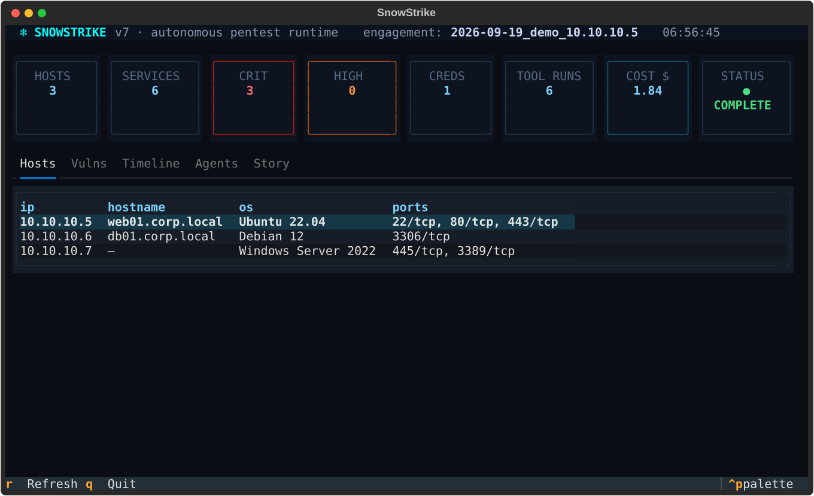
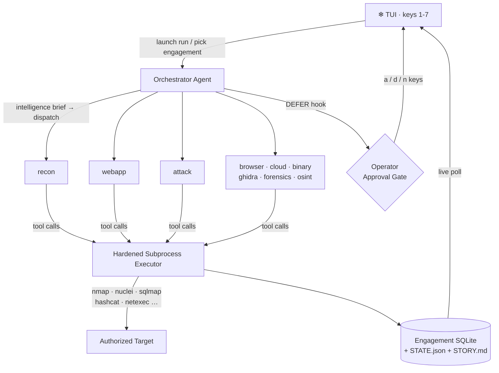
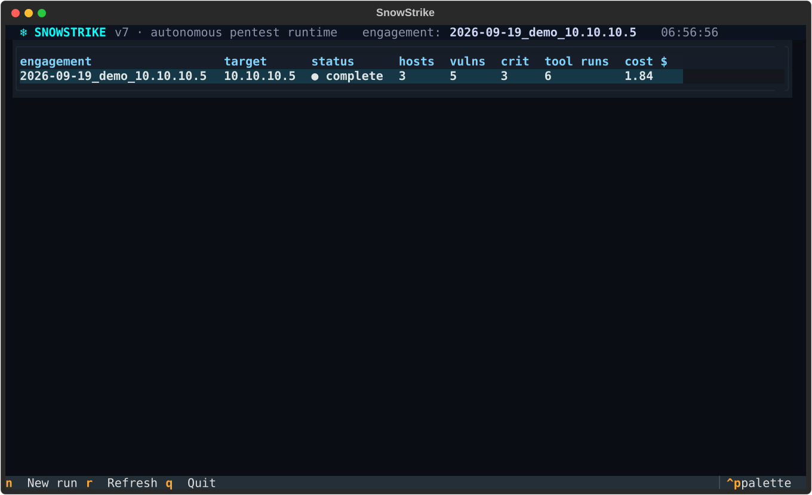
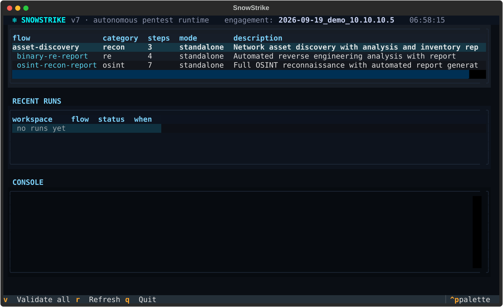
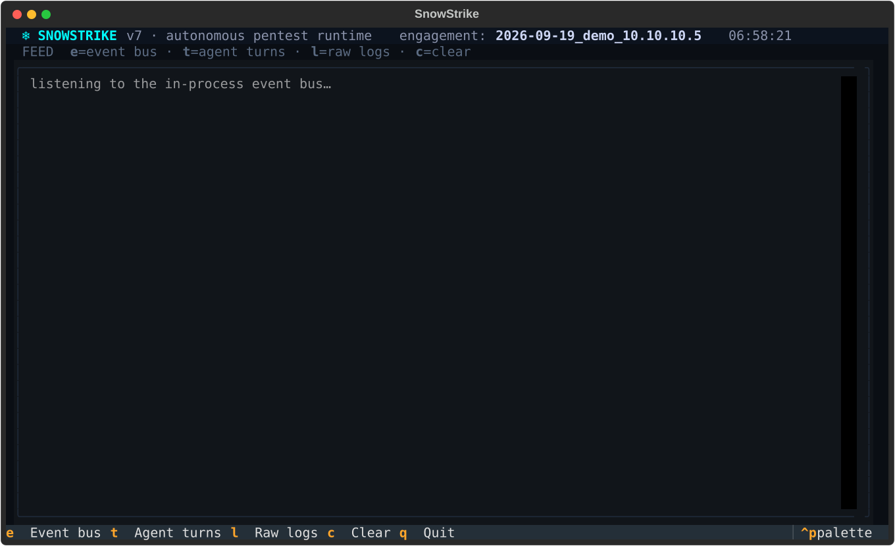

# ❄ SnowStrike

> **An autonomous multi-agent orchestrator for penetration testing — driven from a terminal UI that feels like a cockpit.**



[](LICENSE)
[](pyproject.toml)
[](#testing)
[](https://github.com/textualize/textual)
[](tools/catalog/)

SnowStrike is a Python multi-agent penetration testing runtime for **authorized security
testing**. An LLM orchestrator runs an iterative intelligence-brief decision loop and dispatches
specialist agents (`recon`, `webapp`, `attack`, `cloud`, `binary`, ...) that execute real
security tooling — nmap, nuclei, sqlmap, hashcat, netexec — through a hardened subprocess
executor. Everything is observable live from a [Textual](https://github.com/textualize/textual)
terminal UI: hosts, vulnerabilities, agent chatter, spend, and operator approvals.

## 🧠 How It Works

Each iteration, the orchestrator evaluates a compact **intelligence brief** — current state,
findings, failed approaches — and picks the single highest-value next action. It dispatches
that action to a specialist agent, results land in a shared memory layer, and the next brief
gets smarter. The loop runs until the objective is met or iteration limits hit.



**Flows** complement the autonomous loop: user-defined DAG pipelines that mix agentic steps
with deterministic ones (tool runs, HTTP calls, transforms, conditionals, parallel forks) for
repeatable sequences. See [docs/flows.md](docs/flows.md).

## 🖥️ The TUI

One command, seven views, number keys to move between them:

```bash
python snowstrike_cli.py tui
```

| Key | View | What you get |
|-----|--------------|--------------|
| `1` | Overview | Stat cards (hosts, services, crit/high vulns, creds, tool runs, cost) + tabs for hosts, vulnerabilities, timeline, agent activity, and the engagement story |
| `2` | Engagements | Every engagement on disk with live counts; `n` launches a new autonomous run in a worker thread |
| `3` | Agents | YAML agent roster (models, tools, concurrency) + saved model configs per role |
| `4` | Tools | The full 158-tool catalog; `/` search, `c` cycle categories, binary-availability column |
| `5` | Flows | List definitions, `v` validate all, `enter` run with an input dialog, results console |
| `6` | Approvals | Pending operator gates — `a` approve, `d` deny, `n` approve with a note |
| `7` | Logs | `e` in-process event bus, `t` live agent turns, `l` raw tool output browser |







## ⚡ Key Features

- 🤖 **Autonomous agent swarm** — 10 specialist agents + orchestrator, coordinated through an
  intelligence-brief decision loop instead of fixed scripts
- 🧰 **158 YAML tool wrappers** — nmap to zsteg, with binary compatibility probing; missing
  binaries are skipped cleanly, a partial toolset still runs
- 🖥️ **Real-time TUI dashboard** — built with Textual: live engagement intel, tool catalog,
  flow runner, and operator approval gates, all in the terminal
- 🔒 **Scope guardrails** — scope validator, monitor, and hook system; `DEFER` rules escalate
  to a human before risky actions execute
- 📊 **Instant reporting artifacts** — every engagement materializes an SQLite store,
  `STATE.json`, `STORY.md` narrative, network map, and metrics/cost tracking
- 🧩 **Flows engine** — 10 step types (agent, tool, http, transform, condition, parallel_fork,
  subflow, wait_event, template, artifact) with event/schedule/manual triggers
- 🖴 **Profiles system** — save per-role model configs, run test matrices, compare engagements,
  export CSV

## 🚀 Quick Start

### Prerequisites

* Python 3.12+
* At least one LLM provider API key (Anthropic, OpenAI, or xAI)
* Security binaries for the agents you plan to use (a partial toolset is fine)

### Installation

```bash
git clone https://github.com/2BE-ops/snowstrike.git
cd snowstrike
python3 -m venv snowstrike-env
source snowstrike-env/bin/activate    # Windows: snowstrike-env\Scripts\activate
pip install -e ".[dev]"

cp .env.example .env
# edit .env — at minimum one provider key (e.g. ANTHROPIC_API_KEY)
```

Optional, for browser-driven workflows:

```bash
pip install -e ".[browser]"
playwright install chromium
```

### Run the TUI

```bash
python snowstrike_cli.py tui
```

Press `2` for engagements, `n` to launch an autonomous run against an authorized target, then
`1` to watch hosts, vulnerabilities, and the story build in real time.

### CLI only

```bash
python snowstrike_cli.py --help
python snowstrike_cli.py flow-list
python snowstrike_cli.py flow-validate --all
python snowstrike_cli.py flow-run asset-discovery --input target=10.10.10.5
```

### Python API

```python
from agents.orchestrator import OrchestratorAgent

orch = OrchestratorAgent.create_engagement(
    target="10.10.10.5",
    scope="10.10.10.0/24",
    methodology="standard",
)
result = orch.run_autonomous()
print(result)
```

## 🕵️ Agent Catalog

| Agent | Role |
|-------|------|
| `orchestrator` | strategy, dispatch, guardrails, iterative control |
| `recon` | host/service discovery and environment mapping |
| `webapp` | web discovery, fuzzing, injection testing |
| `browser` | rendered page analysis and browser evidence collection |
| `attack` | exploitation, credential attacks, post-exploitation |
| `cloud` | cloud / container / K8s assessment |
| `binary` | reverse engineering and exploit-dev tasks |
| `ghidra` | Ghidra-backed RE via the MCP bridge |
| `forensics` | memory, file, stego, crypto triage |
| `osint` | passive external intelligence |
| `reporting` | report synthesis from stored artifacts |
| `alerts` | lightweight monitoring and anomaly highlighting |

See [docs/agents.md](docs/agents.md) for the agent engineering guide.

## 🧩 Modular Configuration

Agents and tools are defined in k8s-style YAML and loaded at startup by dynamic registries
(the system falls back to hardcoded Python definitions if no YAML is found).

Agent config (`agent-configs/agents/recon.yaml`):

```yaml
apiVersion: snowstrike/v1
kind: Agent
metadata:
  name: recon
  version: 1
spec:
  display_name: "Recon Specialist"
  agent_class: agents.recon_agent.ReconAgent
  model: claude-sonnet-4-20250514
  max_turns: 30
  max_concurrent: 3
  prompt:
    template: recon
  tools:
    - nmap_scan
    - masscan_scan
  capabilities:
    produces: [open_ports, service_versions]
    requires: [target_hosts]
  handoff_targets: [webapp, attack, orchestrator]
```

Tool config (`tools/catalog/nmap_scan.yaml`):

```yaml
apiVersion: snowstrike/v1
kind: Tool
metadata:
  name: nmap_scan
  category: network_scanning
  requires_root: true
  binary: nmap
spec:
  description: "Run nmap port scan against target"
  input_schema:
    type: object
    properties:
      target: { type: string }
      ports: { type: string }
    required: [target]
  timeout: 420
  compatible_agents: [recon, attack]
```

Adding an agent or tool is a YAML edit — no code changes.

## ⚙️ Configuration

Runtime configuration is in `config/settings.py`; the model registry is `config/models.yaml`.
Model tiers: `orchestrator`, `planning`, `tool_calling`, `compaction`.

Common environment variables (see `.env.example` for the full list):

- Provider keys: `ANTHROPIC_API_KEY`, `OPENAI_API_KEY`, `XAI_API_KEY`
- Model tier overrides: `SNOWSTRIKE_ORCHESTRATOR_MODEL`, `SNOWSTRIKE_TOOL_CALLING_MODEL`,
  `SNOWSTRIKE_COMPACTION_MODEL`
- Runtime limits: `SNOWSTRIKE_MAX_PARALLEL`, `SNOWSTRIKE_MAX_TURNS`, `SNOWSTRIKE_MAX_ITERATIONS`
- Registry paths: `AGENT_CONFIG_DIR`, `TOOL_CATALOG_DIR`

## 📁 Directory Structure

```
snowstrike/
  agents/                   # Orchestrator, base agent, registry, 10 specialists
  tools/
    catalog/*.yaml          # 158 tool wrappers
    executor.py             # Hardened subprocess executor
    hooks.py                # Hook-based tool interception (incl. DEFER → approvals)
  flows/                    # DAG engine, triggers, 10 step handlers, examples
  memory/                   # SQLite, shared state, event bus, approvals, compaction
  profiles/                 # Model configs, metrics, engagement comparison
  data/                     # Read-only engagement DB/file readers (TUI's data layer)
  tui/                      # Textual terminal UI (7 views)
  agent-configs/            # Agent YAMLs, templates, topology presets
  config/                   # Runtime config, model registry, JSON schemas
  tool_runner/              # Optional remote tool-execution service
  docker/                   # Dockerfiles (snowstrike, ghidra, toolrunner)
  tests/                    # Pytest suites (110 tests)
```

Each engagement lives under `engagements/<name>/` with `snowstrike.db`, `STATE.json`,
`STORY.md`, `network_map.json`, raw tool logs, and `loot/`.

## 🐳 Docker

A three-service stack (SnowStrike TUI + Ghidra MCP + tool runner):

```bash
docker compose run --rm snowstrike
```

Ghidra and tool-runner are internal services with health checks; the SnowStrike container is
interactive and drops you straight into the TUI.

## 🧪 Testing

```bash
pytest -q
```

110 tests across suites in `tests/`: command builders, tool failure hardening, replay harness,
dynamic limits, orchestrator guards, and master profiles. The TUI has a headless smoke test
that boots the app and walks all seven views:

```bash
python tui/smoke_test.py
```

## 📚 Documentation

- [docs/flows.md](docs/flows.md) — flow engine: step types, triggers, CLI, examples
- [docs/agents.md](docs/agents.md) — agent engineering guide and best practices

## Operational Boundaries

- Many integrated security tools need elevated privileges or capabilities.
- The TUI and CLI operate on the same engagement state and are not isolated sandboxes.
- `STATE.json` is for coordination; SQLite is the better source for structured post-run facts.
- Autonomous quality depends on strict JSON decisions from the orchestrator model.

> [!CAUTION]
> **Legal Disclaimer:** SnowStrike is designed for authorized security testing and educational
> purposes only. Unauthorized scanning or exploitation of targets without explicit prior
> permission is illegal. You are responsible for complying with all applicable laws, contracts,
> and rules of engagement. The authors assume no liability for any misuse or damage caused by
> this software.

## License

Released under the [MIT License](LICENSE).
